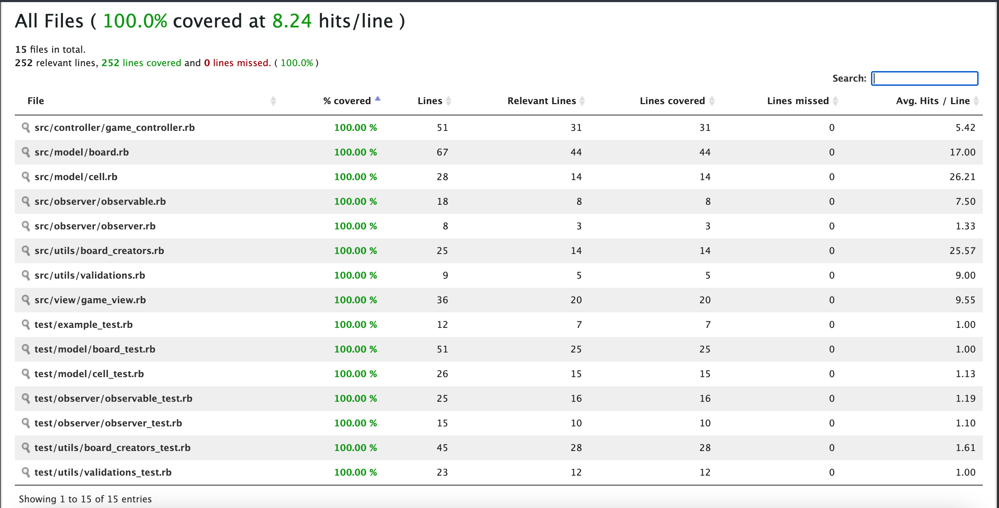
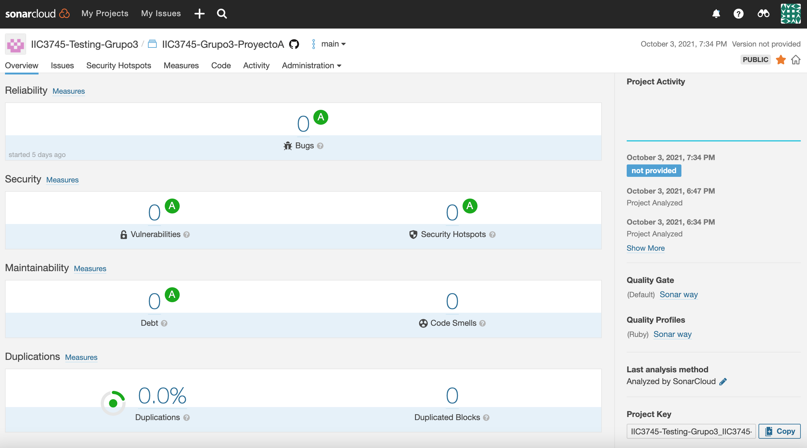

# Minesweeper Grupo 3

## Demo: https://drive.google.com/file/d/14MrcBfxmveKi3C5Cs0FUahV5HnIL0std/view?usp=sharing

## Contenido

- [Integrantes](#integrantes)
- [Detalles](#detalles)
- [Setup](#setup)
- [Tests](#tests)
- [Linters](#linters)
- [CI](#ci)

### Integrantes

- [José Tomás Escobar](https://github.com/JohnTrombon)
- [Humberto Ortúzar](https://github.com/humbertoortuzar)
- [Andrés Pincheira](https://github.com/arpincheira)
- [Moisés Retamal](https://github.com/meretamal)
- [Diego Vásquez](https://github.com/dhvasquez)

### Detalles

Proyecto hecho en ruby 3.0 para el ramo IIC3745 Testing 2021 2.

### _Setup_

Para correr esta aplicación primero clona este repositorio e instala las dependencias:

```bash
bundle install
```

Una vez realizado, para iniciar la aplicación ejecuta:

```bash
ruby src/main.rb
```

### _Tests_

Para ejecutar los tests corre:

```bash
rake test:all
```

Este comando ejecutará todos los _tests_ que se encuentran en la carpeta [test](./test) y generará una carpeta llamada **coverage**, la cual tendrá un archivo **index.html** con el detalle de la cobertura abordada con los _tests_ realizados.

### _Linters_

Dentro de este proyecto ocupamos [Rubocop](https://rubocop.org/) y [SonarCloud](https://sonarcloud.io/) para poder análizar nuestro código y asegurarnos de seguir una guía común de estilo y buenas prácticas.

### CI

Cada _pull request_ está configurada de tal manera que corran los tests, rubocop y sonarcloud (utilizando [_Github Actions_](./.github/workflows/rubyworkflow.yml)), bloqueando la opción de integrar esta rama a _main_ si es que uno de estos _checks_ falla.

También es requisito que cada rama esté al día con _main_ con tal de asegurarnos de que contenga los últimos cambios y tests y así no romper nada.

### Results

#### Cobertura de tests `rake test:all`


#### Análisis estático

